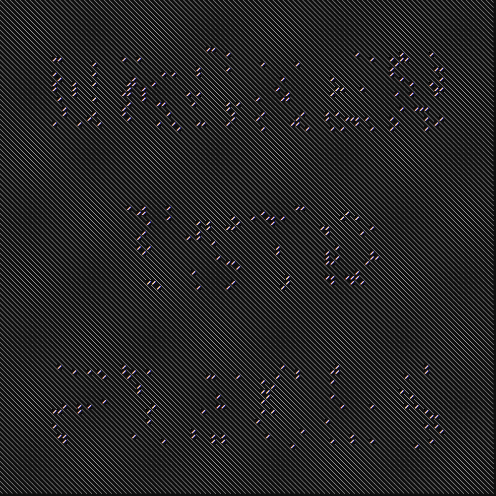
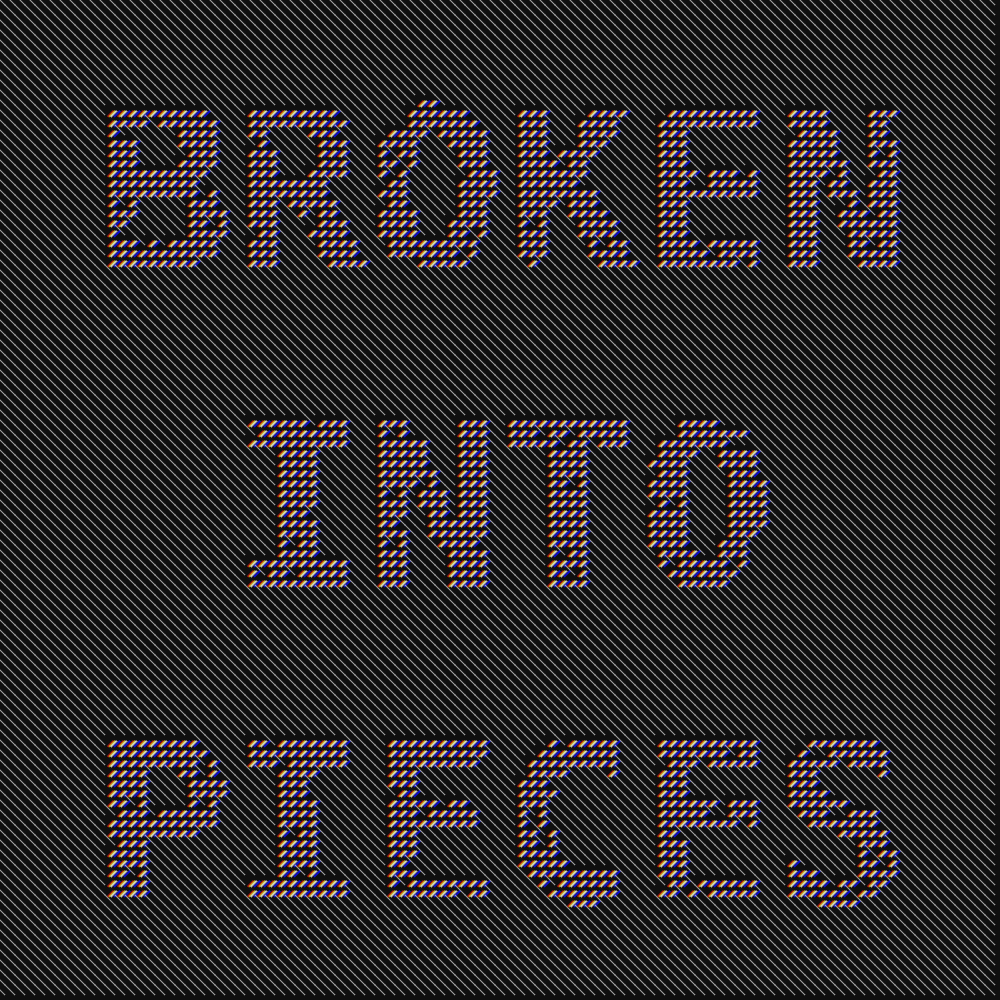
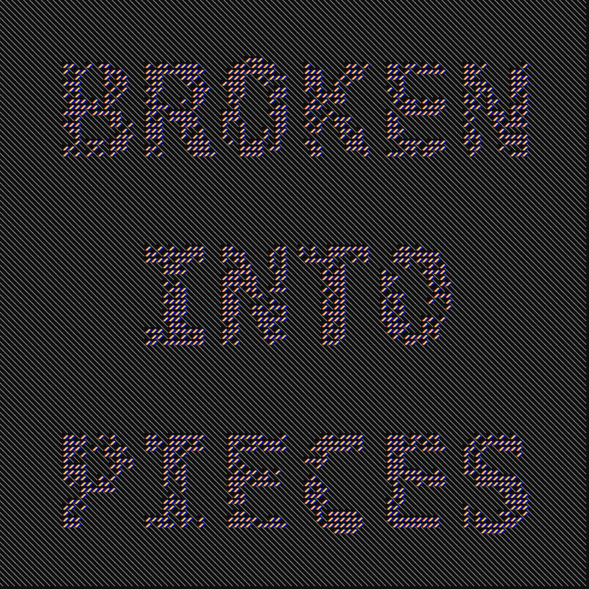

# DIAGONAL NOISE

I already mentioned that I like playing with shapes, colors and text.
This is one of the many videos that I made and only recently decided to post.

I don't know what I am not doing right but all my GIFs lately have been very big. *What am I doing wrong, FFMPEG? TELL ME!*
Anyway, you can check out a few frames here below or have a look at the rendered output on my [Instagram profile](https://www.instagram.com/lorossi).

